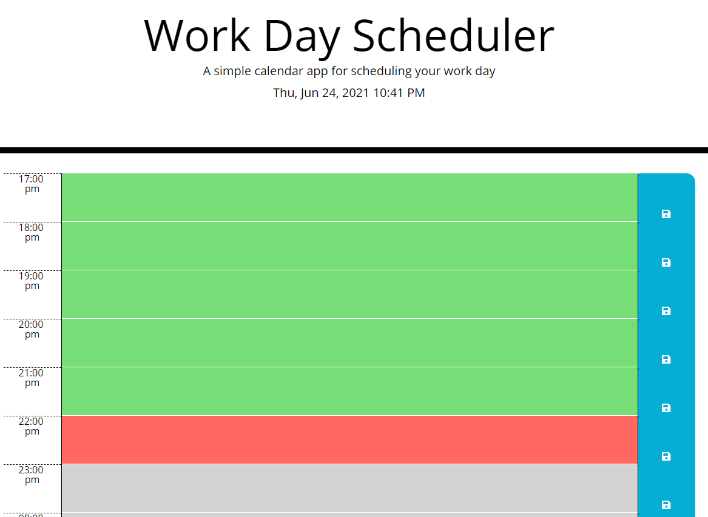

# Work Day Scheduler
If you want to organize your daily schedule?   
Come to my [**Work Day Scheduler**](https://zzangu0215.github.io/Work_Day_Scheduler/) to put your schedules!

## Features

1. You can see **THREE** colors in the scheduler.
    - **GREEN** indicates the schedules that are already passed 
    - **RED** indicates the schedule that is in progress now
    - **GRAY** indicates the planned schedules from now

    

2. The **Date & Time** are updated every 1 minute.
3. The entire **Schedule** is updated every 10 minutes.
4. You can **save** the schedules by clicking the save button.

That's it! Go ahead and see the demo video, and go ahead put your schedule and manage your time wisely!

## Demo Video

Here is the [**Demo Video Link**](https://youtu.be/vBB_upXuqXY)

## Author

- **Jun Park**
    - Portfolio: [**Portfolio**](https://zzangu0215.github.io/portfolio/) (to be updated)
    - Email: tajo0215@gmail.com
    - SNS: https://www.instagram.com/o0ojunny/